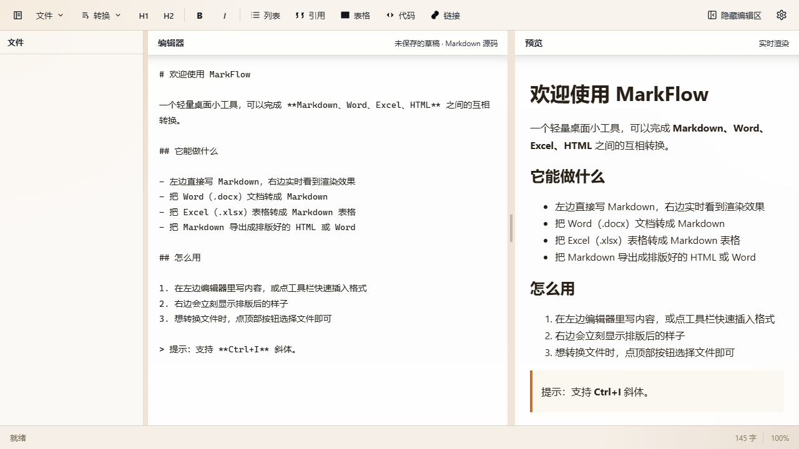
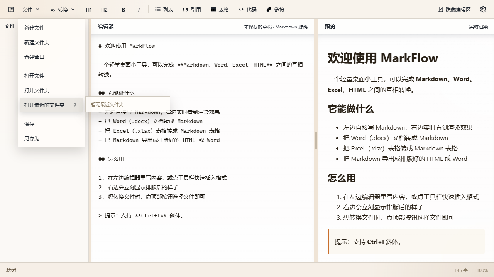

<div align="center">


# MarkFlow

本地优先的 Markdown 文档转换、编辑与文件夹工作台

Markdown、Word、Excel、HTML 的转换、编辑、预览和文件夹管理都在一个桌面应用中完成。

[](https://github.com/PanJitao/word-to-markdown/releases/latest)


[](LICENSE)

[下载最新版本](https://github.com/PanJitao/word-to-markdown/releases/latest) · [核心功能](#核心功能) · [使用方式](#使用方式) · [自行构建](#自行构建)

</div>

---

## 项目简介

MarkFlow 面向日常写作、文档整理和格式转换。它提供 Markdown 源码编辑与实时预览，支持 Word、Excel 导入为 Markdown，并将 Markdown 导出为 Word 或独立 HTML。打开文件夹后，可在左侧文件树中浏览 Markdown 和图片资源。

当前源码版本为 `0.3.21`。转换、预览、外观设置和文件夹操作均在本机完成，文档不会上传到服务端。

## 截图

### 文件夹工作区与实时预览



### 文件菜单与最近文件夹



## 核心功能

### 文件夹工作区

- 通过“文件 -> 打开文件夹”载入工作区，左侧文件树按需展开，避免扫描整个目录。
- 文件树可收起、展开、左右拖拽调整宽度，宽度会保存在本机。
- 在文件树中点击 Markdown 文件即可打开；点击图片可将相对于当前 Markdown 文件的路径插入编辑器。
- “最近打开的文件夹”以右侧二级菜单显示，靠近窗口边缘时自动向左展开。
- 文件菜单支持新建文件、新建文件夹、新建窗口、打开文件、打开文件夹、保存和另存为。

### Markdown 编辑与预览

- Markdown 源码编辑与实时预览并排显示，编辑区可独立隐藏。
- 编辑区与预览区上下滚动同步，中间分隔条可调整两区宽度。
- 列表和引用按 Enter 自动续写当前层级；空标记行再次按 Enter 可退出结构。
- 工具栏支持标题、加粗、斜体、列表、引用、表格、代码块和链接。
- 支持全局撤回，编辑区、格式工具和预览表格修改均可使用 `Ctrl/Command + Z`。
- 自动恢复上次编辑内容、当前文件和界面布局。

### 表格、代码块与右键菜单

- 预览表格可直接编辑单元格，悬停表格边界可新增或删除行、列；双击单元格可选中该单元格内容。
- 代码块提供行号、JSON 键值高亮和复制图标，支持 Java、Python、JavaScript、Node.js、C、C++、C#、SQL、PowerShell、CMD/BAT 等语法高亮。
- 编辑器右键菜单提供复制、粘贴、JSON 格式化、插入表格、插入引用、插入图片和多语言代码块。
- JSON 格式化失败时会显示具体行号、列号和解析原因。

### 内容显示与外观

- 支持 `Ctrl/Command + 滚轮`、`Ctrl/Command + +` 和 `Ctrl/Command + -` 缩放编辑与预览内容，范围为 `70% - 180%`。
- 支持 PNG、JPG、WebP、GIF、MP4、WebM 作为静态或动态背景素材，单个文件最大 `100 MB`。
- 可设置背景底色、背景透明度、面板和按钮透明度、代码块背景透明度以及编辑器/预览字体颜色。
- 支持自动反色和独立的面板背景模糊开关；设置会保存在本机。

### 文档转换

所有转换均在本机执行，不上传文档内容。

| 转换方向 | 说明 |
| --- | --- |
| Word -> Markdown | 保留标题、列表、表格、合并单元格和图片标记等结构。 |
| Excel -> Markdown | 将每个工作表转换为 Markdown 表格。 |
| Markdown -> Word | 生成真实 `.docx`，支持标题、列表、表格、代码块、链接和嵌套文本格式。 |
| Markdown -> HTML | 导出带基础排版的独立 HTML 文档。 |

### 桌面集成

- 可将 MarkFlow 加入 `.md` 文件的“打开方式”，并注册资源管理器“新建 Markdown 文档”菜单。
- 可跳转至系统默认应用设置，将 MarkFlow 设置为 Markdown 默认程序。
- 双击 `.md` 文件或通过系统右键打开时，文档会直接载入编辑区，窗口标题显示文件名。

## 下载与使用

前往 [GitHub Releases](https://github.com/PanJitao/word-to-markdown/releases/latest) 下载对应平台的安装包。

| 平台 | 文件名格式 |
| --- | --- |
| Windows x64 | `MarkFlow_<version>_x64-setup.exe` |
| macOS Apple Silicon | `MarkFlow_<version>_aarch64.dmg` |
| macOS Intel | `MarkFlow_<version>_x64.dmg` |

Windows 10/11 通常已内置 WebView2。少数旧系统如缺少该运行时，可从 [Microsoft Edge WebView2](https://developer.microsoft.com/microsoft-edge/webview2/) 安装。

## 使用方式

1. 选择“文件 -> 打开文件夹”，在左侧文件树中打开或新建 Markdown 文件。
2. 在编辑区输入或粘贴 Markdown，右侧即时查看渲染结果。
3. 使用右键“插入图片”或点击文件树中的图片，插入可随文件夹移动的相对路径。
4. 使用“转换”菜单导入 Word、Excel，或将 Markdown 导出为 Word、HTML。
5. 使用“设置 -> 外观设置”调整背景、透明度、字体颜色和模糊效果。

## 快捷键

| 快捷键 | 功能 |
| --- | --- |
| `Ctrl/Command + B` | 展开或收起左侧文件树 |
| `Ctrl/Command + I` | 斜体 |
| `Ctrl/Command + Z` | 撤回编辑区、工具栏或预览表格修改 |
| `Ctrl/Command + 滚轮` | 放大或缩小内容显示 |
| `Ctrl/Command + +` | 放大内容显示 |
| `Ctrl/Command + -` | 缩小内容显示 |
| `Tab` | 插入两个空格，或为选中行增加缩进 |
| `Shift + Tab` | 减少缩进 |
| `Esc` | 关闭菜单或对话框 |

## 自行构建

### 环境要求

- Node.js `20` 或更高版本。
- Rust stable 工具链和 Cargo。
- Windows 构建需安装 WebView2 运行时。

### 开发与测试

```bash
# 安装依赖
npm install

# 启动 Tauri 开发应用
npm run tauri -- dev

# 仅启动前端页面，访问 http://127.0.0.1:1420
npm run dev

# 前端生产构建
npm run build

# 转换逻辑冒烟测试
node scripts/smoke-convert.mjs
```

### 打包

```bash
# 根据当前系统生成默认安装产物
npm run tauri -- build

# 仅构建 Windows NSIS 安装程序
npm run tauri -- build --bundles nsis
```

Windows NSIS 安装程序输出至：

```text
src-tauri/target/release/bundle/nsis/MarkFlow_0.3.21_x64-setup.exe
```

## 项目结构

```text
├─ index.html                 界面结构
├─ package.json               前端依赖与脚本
├─ docs/screenshots/          README 截图
├─ src/
│  ├─ main.ts                 界面交互、文件工作区、预览和外观控制
│  ├─ style.css               界面、文件树与编辑器样式
│  └─ lib/
│     ├─ appearance.ts         外观设置与背景素材本地存储
│     ├─ convert.ts            docx、xlsx、Markdown 转换
│     ├─ io.ts                 Tauri 文件读写封装
│     └─ markdown.ts           Markdown 渲染与 HTML 导出
└─ src-tauri/
   ├─ src/main.rs             Rust 文件系统命令、文件关联与外部链接处理
   ├─ icons/                  Windows 与 macOS 应用图标
   └─ tauri.conf.json         窗口、CSP 与打包配置
```

## 技术栈

- 桌面外壳：[Tauri v2](https://tauri.app/) 和 Rust。
- 前端：原生 TypeScript 与 [Vite](https://vitejs.dev/)。
- Word 导入：[mammoth](https://github.com/mwilliamson/mammoth)。
- Excel 导入：[SheetJS](https://sheetjs.com/)。
- Word 导出：[docx](https://github.com/dolanmiu/docx)。
- HTML 转 Markdown：[turndown](https://github.com/mixmark-io/turndown) 和 `turndown-plugin-gfm`。
- 渲染与清理：[markdown-it](https://github.com/markdown-it/markdown-it)、[highlight.js](https://highlightjs.org/) 和 [DOMPurify](https://github.com/cure53/DOMPurify)。

## 许可证

本项目采用 [MIT License](LICENSE) 开源。你可以使用、复制、修改、发布和商用本项目代码，但需保留原始版权和许可声明。
